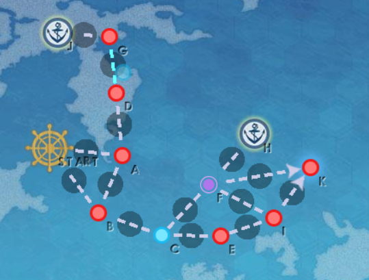

### Hd-1
#### 出击舰队限制：仅携带中、小型船
#### 血条长度：1000
#### 敌情等级：
| 等级  | 对应Buff         |
|-----|----------------|
| 1   | 导弹战阶段受到伤害降低40% |
| 2   | 航空战阶段受到伤害降低40% |
| 3   | 夜战阶段受到伤害降低40%  |
| 4   | 全体回避+20        |
| 5   | 全体命中+20        |
| 6   | 全体装甲+20        |
#### 遭遇战敌人：
普通敌人：潜艇Φ级Ⅳ型/潜艇Φ级Ⅳ型/潜艇Φ级Ⅲ型/潜艇Φ级Ⅲ型/潜艇Φ级Ⅱ型/潜艇Φ级Ⅱ型[单纵阵]

精英敌人：潜艇Φ级Ⅳ型/潜艇Φ级Ⅲ型/潜艇Φ级Ⅲ型/旗舰Ν级Ⅰ型/驱逐Τ级Ⅱ型/驱逐Τ级Ⅱ型[单纵阵]
#### 遭遇战迎击编队编成限制：无
#### 作战平台打捞特殊奖励：
快速建造工具×10、打捞出来的神秘宝箱×1
### 地图

使用网站：https://jebzou.github.io/kancolle-replay/makeEvent.html
（非最终成品，仅用于描述点位拓扑关系）
#### 特殊任务：
| 任务名         | 任务目标                                      | 奖励                   |
|-------------|-------------------------------------------|----------------------|
| 清除敌情 Ex-6 H | 击败位于EX-6 H点敌人并取得S胜或以上的评价。                 | Buff：持久作战 经验值×75 |
| 清除敌情 Ex-6 J | 击败位于EX-6 J点敌人并取得S胜或以上的评价。                 | Buff：弹无虚发 经验值×75 |
| 第三类接触？      | 仅携带小型船且至少携带1艘潜艇，击败位于EX-6 K点敌人并取得S胜或以上的评价。 | 功勋点×90 经验值×90    |
#### 带路条件：
| 分歧点 | 条件                                    |
|-----|---------------------------------------|
| 出发点 | A：SS≥2 B：BM≥2 权重：A:B=1:1      |
| B   | A：ASDG≥2 C：最低航速＜21 权重：A:C=3:1 |
| C   | E：CVL≥2 F：DD≥2 权重：E:F=1:1     |
| F   | H：AP≥1 I：SC≥1 或 SS≤0 K：SS≥1   |

#### 敌人配置：
| 点位  | 配置  | 阵型  |
|-----|-----|-----|
| A   |     |     |

